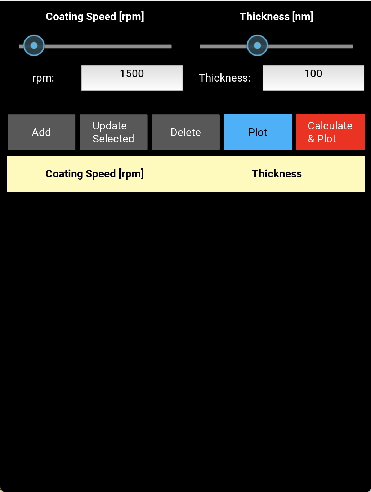

# Spin Calculator

A cross-platform mobile and desktop app built with **Kivy** and **Python** for spin-coating analysis in thin film laboratories.

The app allows you to collect coating speed (RPM) and film thickness (nm) data points, fit a power-law model in log-log space, and predict the coating speed needed to achieve a target film thickness.

---

## Features

- **Data entry** — input RPM and Thickness values using sliders with synced editable text boxes
- **Data table** — scrollable table with row selection, update, and delete
- **Scatter plot** — visualise raw data points (RPM vs Thickness)
- **Log-log fit** — power-law regression using `numpy.polyfit` in log-log space
- **Analysis plot** — full plot with:
  - Dashed fit curve
  - Raw scatter points
  - Mean ± std error bars per RPM
  - Target thickness point (red square)
  - Coating speed suggestion or out-of-range warning
- **Target thickness calculator** — enter a target thickness and get the predicted coating speed instantly
- **Android-ready** — builds to an APK via Buildozer + Docker

---

## Screenshot



---

## Requirements

### Python packages
```
kivy==2.3.0
numpy
```

### For Android build
```
docker
buildozer
cython==0.29.36
python-for-android
```

---

## Installation

### Run on Desktop

1. Clone the repository:
```bash
git clone https://github.com/BrindabanKundu/CoatingSpeedApp.git
cd CoatingSpeedApp
```

2. Create a virtual environment and install dependencies:
```bash
python3 -m venv venv
source venv/bin/activate
pip install kivy numpy
```

3. Run the app:
```bash
python main.py
```

---

### Build Android APK (via Docker)

> Tested on Linux (Ubuntu/OpenSuse). Docker must be installed.

1. Build the Docker image (only once):
```bash
docker build -t kivy-builder .
```

2. Build the APK:
```bash
docker run --rm \
    -v $(pwd):/app \
    kivy-builder \
    bash -c "cd /app && yes | buildozer android debug 2>&1"
```

3. Find your APK in the `bin/` folder:
```bash
ls bin/*.apk
```

4. Install on your Android device:
```bash
adb install bin/spincalculator-0.1-debug.apk
```

> **Note:** First build takes 30–60 minutes as it compiles the Android NDK, SDK, and all Python dependencies. Subsequent builds use the cache and are much faster.

---

## How to Use

### Collecting Data

1. Set the **RPM** value using the slider or type directly in the text box
2. Set the **Thickness** value (in nm) using the slider or text box
3. Tap **Add** to record the data point
4. To edit a row, tap it to select it → adjust values → tap **Update Selected**
5. To remove a row, select it → tap **Delete**

### Plotting Raw Data

- Tap **Plot** to open a scatter plot of all collected RPM vs Thickness data points

### Running the Analysis

1. Collect at least **2 data points**
2. Tap **Calculate & Plot**
3. Enter your **target Thickness [nm]** in the popup
4. Tap **Calculate & Plot** — the analysis popup shows:
   - The power-law fit curve
   - Your raw data and mean ± std error bars
   - The predicted coating speed for your target thickness (or a suggestion if out of range)

---

## Project Structure

```
spincalculator/
├── main.py            # App logic, analysis, and matplotlib plotting
├── table.kv           # Kivy UI layout
├── buildozer.spec     # Android build configuration
├── Dockerfile         # Docker image for reproducible Android builds
└── README.md
```

---

## Scientific Background

Spin-coating film thickness follows a power-law relationship with coating speed:

$$T = A \cdot \omega^n$$

where:
- $T$ is the film thickness [nm]
- $\omega$ is the coating speed [rpm]
- $A$ and $n$ are material-dependent constants

Taking the base-10 logarithm of both sides gives a linear relationship in log-log space:

$$\log T = \log A + n \cdot \log \omega$$

This app fits this linear model using `numpy.polyfit`, extracts the slope $n$ and intercept $\log A$, and inverts the fit to predict $\omega$ for any target $T$.

---

## License

MIT License — free to use, modify, and distribute.

---

## Author

Brindaban — Materials Science / Thin Film Laboratory
